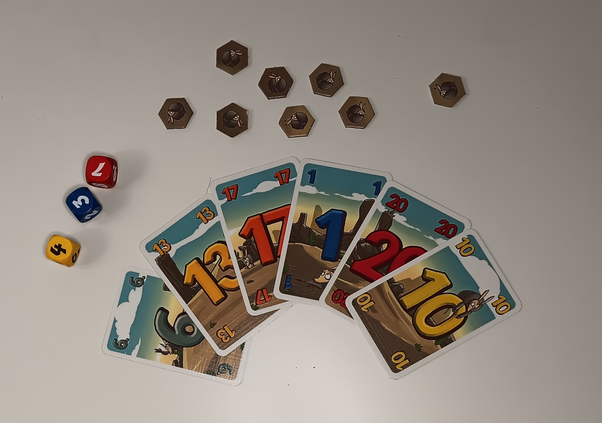
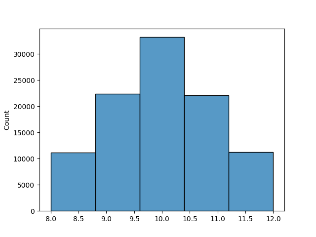
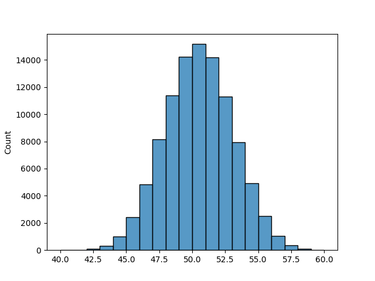

Armadillos with Expecations
===========================

Goal
----
Students calculate expectation values in the dice game **Armadillo**.

Time
----

90'

Core Concepts
-------------

- discrete event
- probability mass functions
- uniform distribution
- triangular distribution
- expectation value
- histogram

The Game: Armadillos
--------------------

*The armadillos are rolling and rolling ...*

In the dice game `Armadillo <http://www.amigo-spiele.de/kartenspiele/armadillo_2254_1195>`__ the players decide which and how many dice they want to roll. The blue, yellow and red dice have values 1-3, 4-6 and 7-9 respectively. Once the dice have been rolled, the rolls are summed up and players may discard a matching card. Otherwise they get a bonus token they may use later.

Armadillo scales nicely to big groups because the players act in parallel. You might share each player 6 instead of 8 cards to shorten the playing time. But the game works even with 10 players without becoming very long, so that you can play an entire match during a lesson.

.. topic:: Game Rules

   1. shuffle the cards and give 8 to each player
   2. one player rolls as many dice as they like
   3. sum up the rolls
   4. every player checks their cards simultaneously. If they have a card matching the sum, they discard *one*
   5. if you did not discard a card: may pay tokens to modify a card value by 1 per token and discard
   6. if you did not discard a card: take a token
   7. if you have no cards, you win

.. note::

   In the game **Machi Koro** (see next chapter), the expectation values are more compleex because they involve coin values.

Lesson Plan
-----------

The Armadillo game makes for a great introduction into probability mass distributions, because the dice are a lot simpler than your standard D6. The main result of the lesson are probability tables and histograms for the uniform (1 die) and triangular distribution (2 dice). You have the option to leap towards 3+ dice and catch a glimpse of the Central Limit Theorem with reasonable effort.

====== ==================================================================================== =======
step   description                                                                          time
====== ==================================================================================== =======
1.     play a full match of Armadillo                                                       15'
2.     draw a probability table and histogram for one die (uniform)                         10'
       introduce terminology for probability mass distributions
3.     draw a table and histogram for any two dice (triangular)                             10'
4.     optional: draw a histrogram for three dice                                           15'
5.     assign point values to the results (discard: 5, token: 1)                            5'
6.     present the equation for the expectation value                                       5'
7.     calculate expectation values for multiple hands                                      15'
8.     discuss the reflection questions                                                     10'
====== ==================================================================================== =======

Results
-------

*histogram for 100,000 rolls of two yellow dice*

*histogram for 100,000 rolls of 10 yellow dice*

Reflection Questions
--------------------

- How is the expectation value defined?
- Is it generally better to roll one, two or three dice?
- What is the expectation value for throwing three six-sided dice?
- Can an expectation value be negative?
- What is the difference between a histogram and a bar chart?
- Suggest a winning strategy for Armadillo?
