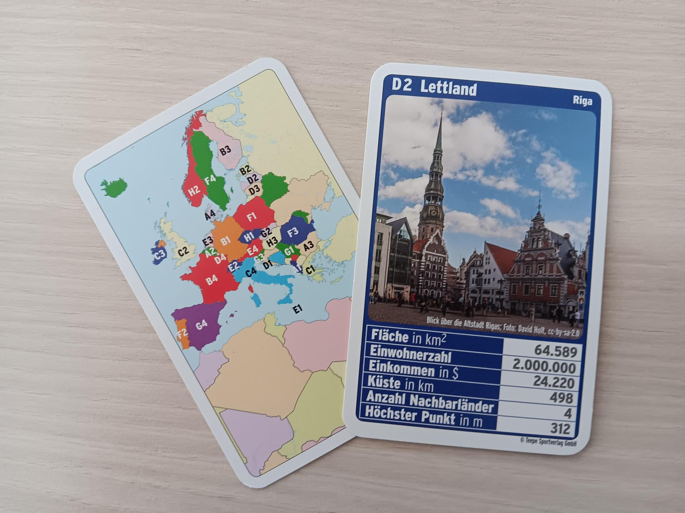

Descriptive Statistics with Top Trumps
======================================

Lesson Goal:
------------

Students calculate measures of centrality and spread from a sample of countries.

Time Frame:
-----------

90’

Key Concepts:
-------------

- **Types of Variables**: category, ordinal, scalar, datetime, discrete, continuous
- **Measures of Centrality**: mean, median, mode
- **Measures of Spread**: range, standard deviation, quartiles

.. topic:: Top Trump Quartets

   A trump quartet can be used in a variety of ways in statistics lessons.
   Small groups can draw cards, summarise them, calculate measuers, enter data, discuss sampling etc.
   I got hold of a deck with European countries for my lessons,
   as I find these more interesting than the race cars or dinosaurs, which are common in the shops.

   I have never played the actual trumps game in class, but the cards have proven an extremely
   cost-efficient teaching tool.

Getting Started
---------------

Share a country card to 5-10 small groups or pairs of students. Take one yourself.
Explain something about the country on your card.
Use information on the card, and others
The others have to guess which country it is.
Then it is the next persons turn.

Lesson Plan
-----------

-  distribute a deck of quartet cards 
-  identify variable types, enumerate them
-  calculate measures of centrality and introduce equations
-  discuss tricky cases add an outlier
-  calculate measures of spread and introduce equations
-  plot the data (bar plot and/or box plot)

Material:
---------

The following exercise sets can be done in Python or an online
spreadsheet:

-  `centrality and dispersion
   exercises <http://www.academis.eu/statistics/exercises/centrality_and_dispersion.html>`__
-  `Variables <http://www.academis.eu/statistics/variables.html>`__
-  `Centrality and Dispersion <http://www.academis.eu/statistics/centrality_and_dispersion.html>`__

.. hint::
   
   The tasks can be implemented perfectly in a **spreadsheet application**.
   You might also use a Google Spreadsheet (add screenshot).
   Also, a programming language or database should work without a lot of modification.

   Make the data entry a collaborative exercise! It will help you to balance the pace.

Reflection questions
--------------------

* what is the difference between mean and median?
* what effect do outliers (e.g. Malta) have on the measures?
* is it important whether a card contains integers or floating point numbers?

.. seealso::

   `Wendels Card Games <https://www.wendels-kartenspiele.de/product-page/ferne-länder-und-länder-europas-im-zweierpack>`__
   `Top Trupmps on Wikipedia <https://en.wikipedia.org/wiki/Top_Trumps>`__
