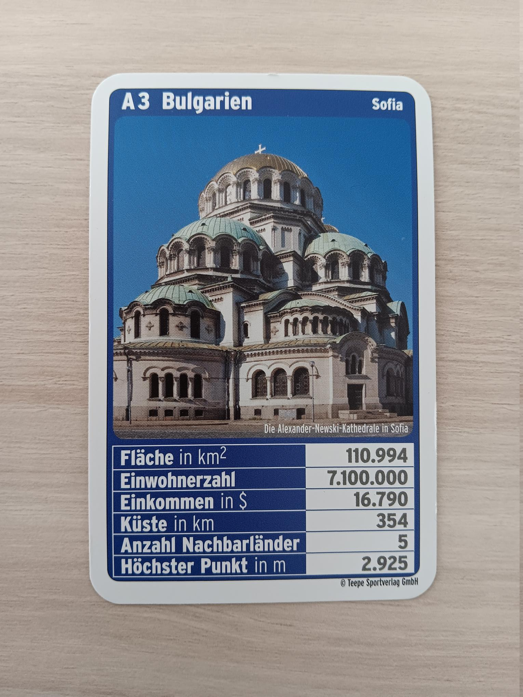

Guess Correlations
==================

*Do bigger countries contain more people?*

Lesson Goal:
------------

Students calculate correlation coefficients.

Time Frame:
-----------

90’

Key Concepts:
-------------

-  correlation coefficient
-  scatter plot
-  causation

Getting Started
---------------

- draw a sample of 12-16 quartet cards
- have students draw a scatterplot (area vs population)
- see if the values clump together because the data covers many orders of magnitude
- if necessary, create a second scatterplot with a log-scale or double-log-scale

Lesson Plan
-----------

-  look for linear relationships in the scatterplot (establish **correlation**)
-  introduce the equation for the correlation coefficient
-  go through possible values of the correlation coefficient and their interpretation
-  exercise: play `www.guessthecorrelation.com/ <https://www.guessthecorrelation.com/>`__
-  calculate the correlation coefficient for one example
-  *optional:* create a heat map of correlations of all against all columns

Histograms
----------

The data allows for a lot of useful digressions on histograms.
If you have a good tool ready, compare the histogram of the values versus their logarithms.
One of them should resemble a normal distribution.

Correlation and Linear Regression
---------------------------------

Correlation as a concept is much easier to establish if students worked
with linear regression before. Likewise, the equation for R using
covariance can be comfortably replaced by:

:math:`r = \frac{m \cdot std_x}{std_y}`

which is a lot more digestible than the equation using covariance.

You might want to introduce :math:`r^2` as a metric for the quality of
the linear fit, take note to emphasize how the square changes things.

.. seealso::

   You might want to discuss some plots from the website `Spurious Correlations <https://tylervigen.com/spurious-correlations>`__.
