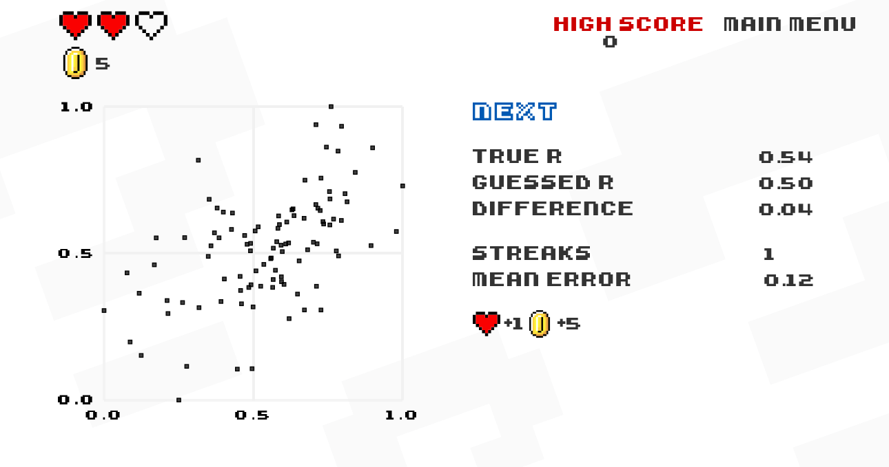
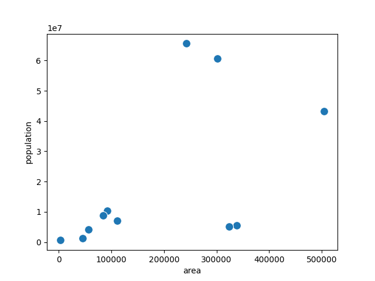
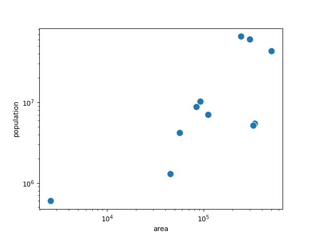

Guess Correlations
==================

.. figure:: ../images/bulgaria.jpg
   :width: 400px

*Do bigger countries contain more people?*

Lesson Goal:
------------
Students draw a line of best fit and calculate correlation coefficients.

Time Frame:
-----------

90’

Key Concepts:
-------------

- scatter plot
- log-scale
- linear regression
- linear equation
- mean squared error
- correlation coefficient

The Game: Guess the Correlation
-------------------------------

*Would you have guessed these correlation coefficients correctly?*

`Guesss the Correlation <www.guessthecorrelation.com/>`__ by Omar Wagih is a small retro-style onlline game. Players are shown a cloud of points and have to guess the correlation coefficient. The closer they get the more points can they collect.

This is not a board game in the strict sense but it makes for a good lesson.
The lesson plan uses it after the half-time break.

Lesson Plan
-----------

This lesson is a logical continuation of the descriptive statistics lesson. 
This time you would use the quartet cards to create a scatter plot.
The scatter plot is a great starting point to introduce new statistical tools.

This is a two-part leson: in the first part a scatter plots of area over population is created.
With most country samples, the distribution is heavily skewed to the left. Double-logarithmic axes fix that. With a good tool you might want to look at the histogram as well.
In the end, you will want to have a line of best fit.

In the second part correlation is introduced. The common equation for the correlation coefficient is quite indigestible for beginner statisticians due to the covariance. Luckily, if you already have a line of best fit, you may want to use the much simpler equation:

.. math::

   r = m \cdot \frac{std(x)}{std(y)}

====== ==================================================================================== =======
step   description                                                                          time
====== ==================================================================================== =======
1.     share 12-16 quartet cards to groups of students                                      1'
2.     have students draw a scatterplot (area vs population)                                10'
3.     inspect results together (they should notice that most larger countries              10'
       also have more people, but the points clump together)
4.     create a second scatterplot with a log-scale or double-log-scale                     15'
       (the histogram might help)
5.     draw a line of best fit. First manually on the board. Discuss the linear             20'
       equation, estimate slope and intercept and discuss their meaning.
       Only then, use a tool to fit the data. Calculate the MSE.
6.     play `www.guessthecorrelation.com/ <https://www.guessthecorrelation.com/>`__         10'
7.     ask for possible values of the correlation coefficient and their interpretation.     10'
       Introduce the equation for the correlation coefficient.
8.     calculate the correlation coefficient for one example                                10'
9.     discuss the reflection questions                                                     10'
====== ==================================================================================== =======

Results
-------

Here is a scatterplot for a sample of country cards:

Here is the same sample with double-log axes. The outlier in the bottom left is Luxemburg, a point not discernible in the first plot.

Comments
--------

The data allows for a lot of useful digressions on histograms.
If you have a good tool ready, compare the histogram of the values versus their logarithms.
One of them should resemble a normal distribution.

You might want to introduce :math:`r^2` as a metric for the quality of
the linear fit, take note to distinguish it from the correlation coefficient.

Obviously, linear regression can be taken a lot further.
Here, the focus is on the visualization and the basic equation.
For an introduction to the statistical concept, using a black-box linreg
function like in Excel or seaborn works. Especially in a course on
Machine Learning you might want to follow up with any of the following:

-  :ref:`correlation`
-  multiple linear regression
-  how to find optimal parameters (Normal Equation vs. Gradient Descent)
-  regularization, Ridge, Lasso
-  assumptions and the Gauss-Markov Theorem

.. seealso::

   You might want to discuss some plots from the website `Spurious Correlations <https://tylervigen.com/spurious-correlations>`__.
