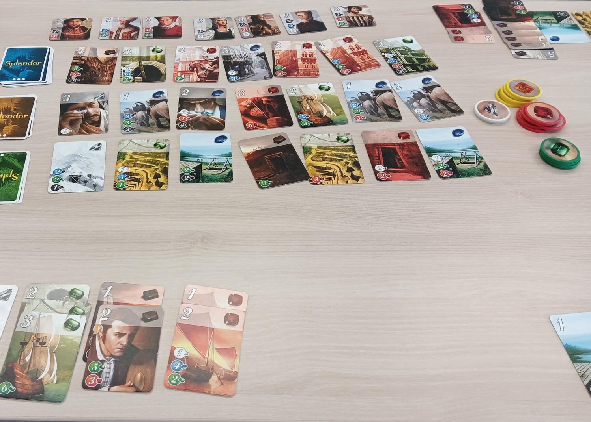

Data Model Splendor
===================

*game scene in Splendor*

Goal
----

Students draw a data model.

Time
----

120'

The Game: Splendor
------------------

I used simplified rules of **Splendor**, to accelerate the game.
The level 3 cards and VIPS were removed completely.
The maximum hand size for chips was reduced to 8.
The game stops immediately if a player reaches 8 points.
This allows to play Splendor in a group of six with one set of material.

However, the lesson works with many different games. I tried **Wizard**, **Boggle**, **Yatzhee** and **Connect Four**.
Many more are possible. Because data modeling is one of the most fundamental skills in data processing,
it may be worth to model multiple games in the same course.

How the Lesson works
--------------------

Datenmodellierung gehört zu den wichtigsten Tätigkeiten beim Entwickeln von IT-Systemen. Ein Datenmodell bestimmt, was für Daten gespeichert werden (Datentypen) und wie sie zueinander in Beziehung stehen (Relationen). Verwendet man eine Datenbank, steht am Anfang meist die Frage, welche Tabellen es geben soll und welche Spalten diese enthalten.

Oft gilt es zwischen mehreren Alternativen abzuwägen. Diese beeinflussen, wie schnell das System bestimmte Anfragen bearbeiten kann, wie leicht es zu ändern ist und welche Arten von Fehlern auftreten können.
Deshalb sollte man bei der Datenmodellierung etwas Sachkenntnis der Materie mitbringen.

A pivotal moment is when the students realize that they need more than one table.

Lesson Plan
-----------

1. explain the rules of the game
2. play a game of Splendor for 20'
3. ask: **"now we want to save the state of the game. What do we need?"**
4. task students to draw tables and their columns to save the game
5. hand out paper
6. let them draw for a while
7. compare results
8. create a data model as an ER-diagram or class diagram together on the board
9. implement the model in SQL, a programming language or a spreadsheet.

.. hint::

    If the students did not have previous exposure to SQL you may want to move the implementation
    of the SQL database in a follow-up lesson.

    If you want to use the VIPs, keep them as extra homework.

    In any case, the students need to have a database installed.
    You may want to consider `DuckDB <https://duckdb.org/>`__ as an easily installable DB engine.

Results
-------

TODO

Continuation
------------
Das Datenmodell kann als Startpunkt einer ganze Serie von Lektionen zu SQL dienen:

- C.R.U.D. Operationen
- Primärschlüssel
- Fremdschlüssel und Kardinalität
- SQL JOIN
- Constraints (CHECK, UNIQUE) 
- Normalisierung von Datenbanken

Reflection Questions
--------------------

- is it better to represent the owner of a card as a number `player_id=3` or as text `owner="Maria"`?
- how can the data model distinguish between open cards and cards in the draw pile?
- how could you distinguish two identical cards?
- is it better to use a single text column for the color of a card (`color='blue'`) or as five columns (`blue=1, red=0`)?
- what effect do typos have (`bleu`)?
- how could you store multiple games?

## Notizen

Das Splendor-Spiel ist eine ausgezeichnetes Priming, das domänenspezifisches Wissen aufbaut. Die Begrenzung auf einen klaren Anwendungsfall ("Spielstand speichern") erlaubt den Transfer in die Praxis.

Beim Formulieren des Datenmodells sollten mindestens zwei Tabellen entstehen. 
Das wichtigste Aha-Erlebnis ist, wenn die Gruppe realisiert, dass zwei Tabellen sinnvoll sind.

Für das Gelingen der Übung ist es unerheblich, ob die Tabellen eine `id`-Spalte enthalten.

Bei Vorkenntnissen läßt sich das Modellieren der Daten auch in Kleingruppen durchführen.

## Fortsetzung

Variations
- die VIPs lassen sich als Hausaufgabe oder Wiederholungsübung modellieren
- das Spiel "Drecksau" lässt sich ebenfalls mit 2+ Tabellen sinnvoll modellieren. Das Datenmodell ist etwas einfacher, dafür ist das Spiel günstiger und einfacher zu transportieren.
- Als Einsteigervariante lässt sich eine Tabellnkalkulation statt SQL verwenden.
- Eine Programmiersprache sollte ebenfalls funktionieren.

## Spielhilfen

### Tabelle mit SQL-Datentypen
...

### Rezept zum Modellieren einer Tabelle

1. Name der Tabelle festlegen: lowercase_plural_nomen
2. Spalten festlegen
3. Datentyp für jede Spalte festlegen
4. id-Spalte hinzufügen (als SERIAL PRIMARY KEY)
5. Fremdschlüssel hinzufügen

### Musterlösung

...

## Links

- Splendor Brettspiel
- Splendor bei boardgamearena
- SQL w3schools
- Online-SQL-Editor
- gitpod SQL?
