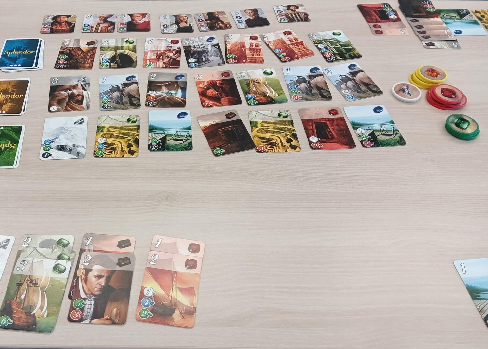

Data Model Splendor
===================

*game scene in Splendor*

Goal
----

Students draw a data model.

Time
----

120'

Data modeling
-------------

Data modeling is a key activity when developing an IT system.
The data model determines what data are stored (data types), where they are kept (data structures) and how they are related (references).
When using a releational database, one needs to answer the question which tables should be there and what columns they should have.

.. topic:: Recipe for data modeling

   You may want to provide the following recipe along with a code example.

   1. decide on the name of the table: `lowercase_plural_noun`
   2. enumerate columns that should be there
   3. decide on the data type for each column
   4. add an `id` column
   5. add foreign keys

Often, more than one data model is possible.
Alternative implementations determine, how easy the system is to modify how fast certain queries are executed.
Therefore domain knowledge helps with data modeling.
By playing a game, you infuse the necessary domain knowledge directly to your class.

In this lesson, the students create a data model for a game.
I have used this lesson with many different games: **Wizard**, **Boggle**, **Yatzhee** and **Connect Four**.
Below, you find a lesson for the game described `Splendor <>`__, but the lesson practically works with any game.

The Game: Splendor
------------------

I used simplified rules of **Splendor**, to accelerate the game:

- The level 3 cards and VIPS were removed completely.
- The maximum number of chips per player was reduced to 8.
- The game stops immediately if a player reaches 8 points.

This not only speeds up the game, but also allows to play Splendor in a group of six with one set of material.

Lesson Plan
-----------

1. explain the rules of the game
2. play a game of Splendor for 20'
3. ask: **"now we want to save the state of the game. What do we need?"**
4. task students to draw tables and their columns to save the game
5. hand out paper
6. let them draw for a while
7. compare results
8. draw a data model as an ER-diagram together on the board
9. implement the model in SQL

.. hint::

    If the students did not have previous exposure to SQL you may want to move the implementation
    of the SQL database to a follow-up lesson.

Results
-------

Here you find a couple of SQL implementations of Splendor and a few other games:

- :download:`splendor.sql`
- :download:`wizard.sql`
- :download:`connect_four.sql`

Reflection Questions
--------------------

- is it better to represent the owner of a card as a number `player_id=3` or as text `owner="Maria"`?
- how can the data model distinguish between open cards and cards in the draw pile?
- how could you distinguish two identical cards?
- is it better to use a single text column for the color of a card (`color='blue'`) or as five columns (`blue=1, red=0`)?
- what effect do typos have (`bleu`)?
- how could you store multiple games?
- how would you add the VIPs (good homework)

Comments
--------

**Splendor** is an excellent priming that builds up domain knowledge.
Addressing a clear use case (*"save the state of the game") makes the practical transfer possible.

A pivotal moment is when the students realize that they need more than one table.
If you choose a different game, make sure that it requires two or more tables.

If the group is strong, you may want them to implement the data model by themselves.

.. hint::

   Because data modeling is one of the most fundamental skills in data processing, it may be worth to model multiple games in the same course.

Continuation
------------

The data model can be used as a starting point for a whole series of SQL lessons:

- C.R.U.D. operations
- primary keys
- foreign keys and cardinality
- SQL JOIN
- Constraints (CHECK, UNIQUE) 
- data normalization

.. hint::

   I have used a very similar lesson structure when modeling data in a programming language using classes.
   With kids, we modeled data in a spreadsheet.

.. seealso::

   - `Splendor Board Game <>`__
   - `Splendor on boardgamearena <>`__
   - `SQL Tutorial on w3schools `<>`__
   - `DuckDB <https://duckdb.org/>`__, an easily installable DB engine.
