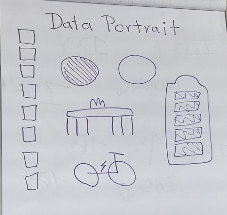

Data Portrait
=============

Goal
----

Students generate data about themselves.

Time
----

5'

Instructions
------------

Draw on a piece of paper:

-  one **square** for each character in your name
-  one **circle** for you and each of your siblings
-  fill the circle indicating yourself, sorted by relative age (oldest, 2nd oldest)
-  a **symbol** that indicates your country of birth
-  your favourite **mode of transportation**: legs for walking, two
   circles for biking, a box with wheels for cars/trains and wings for flying
-  your birthday using **crosses** for the month and **tick marks** for the day

Teaching notes
--------------

The Data Portrait is an easy start into a class or course on a data-related subject.
There are several concepts that can be motivated with the portraits:

- what data is
- types of data
- data collection
- data visualization
- conventions and bias
- put the data from drawing into a spreadsheet or file and start evaluating it

In a presence class, your participants may want to hang up and present their artwork.
The exercise works in an online or hybrid environment as well.

*The first version of the data portrait I saw is attributed to Paula Gonzalez-Avalos*
