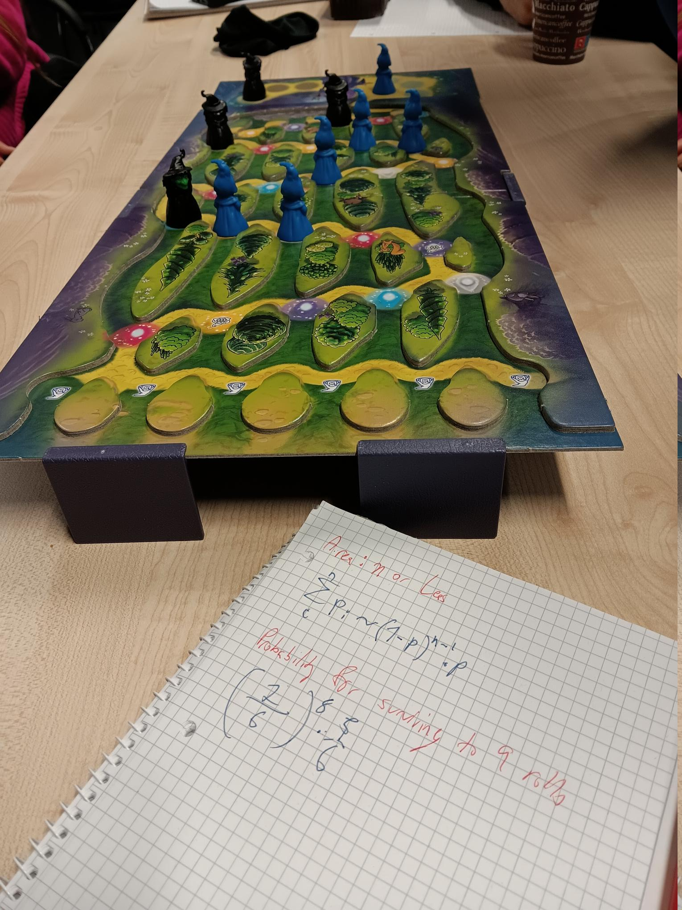

Binomial Magic Mountain
=======================

|image5|

Goal
----

Students create the progression from a simple binomial distribution to a bell curve.

Time
----

45'

Concepts
--------

- binomial distribution
- Bernoulli experiment
- normal distribution
- Central Limit Theorem

The Game
--------
The game `Zauberberg <https://www.amigo-spiele.de/kinderspiele/zauberberg_2050_1179>`__ contains a wonderful binomial distribution.
This is even visible on the game board, which loosely resembles a Galton board.
The participants can calculate probabilities directly.
As the probabilities become more sophisticated from level to level,
the participants should be able to experience that, with increasing depth,
the probability pattern approaches a Gaussian distribution.

Lesson Plan
-----------

1. play the game
2. calculate probabilities where the ball goes for each level
3. introduce the binomial equation
4. see what happens for a higher degree
5. introduce the Central Limit Theorem

.. note::

    I am not particularly fond of the colors or imagery of the game pieces
    and am considering giving them a paint job.
