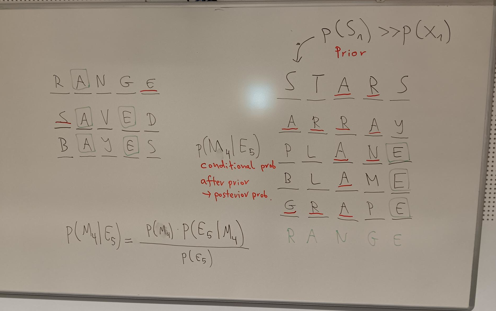

Wordle Entropy
==============

*Wordle on the board*

Goal
----

Students solve Wordles at the beginning of a class.

Time
----

5'

Concepts
--------

- GINI-Score
- Entropy
- Mutual Information

The Game
--------

Wordle is a great warm-up game for lessons that can be used repeatedly.
It is also fantastic for statistics, as it illustrates the topics **conditional probability** and **information theory**.

Good words for getting started are: **RANGE**, **TABLE**, **PIVOT** and **BAYES**.

Lesson Plan
-----------

For a deeper dive into the wordle topic, you might want to apply some information theory.
Using the **SOWPODS list**, an official list of allowed Scrabble words, you can take steps
to help you choose the optimal word in a given situation.

As a simpler metric you could also calculate the GINI-Score.
In any case, the calculation on a larger body of words might require some more time
and skills in a programing language, because the task will get rather tedious in a spreadsheet.

1. download the `SOWPODS list of Scrabble words <https://www.freescrabbledictionary.com/sowpods/download/sowpods.txt>`__
2. calculate the entropy for each position
3. apply a condition, calculate entropy again on the remaining words
4. count frequent combinations of characters
5. calculate mutual information of two columns
6. discuss strategies to find the best guess

.. seealso::

    `Wordle on Wikipedia <https://en.wikipedia.org/wiki/Wordle>`__

.. note::

   *using Wordle in a classroom was brought to me by Christina.*

