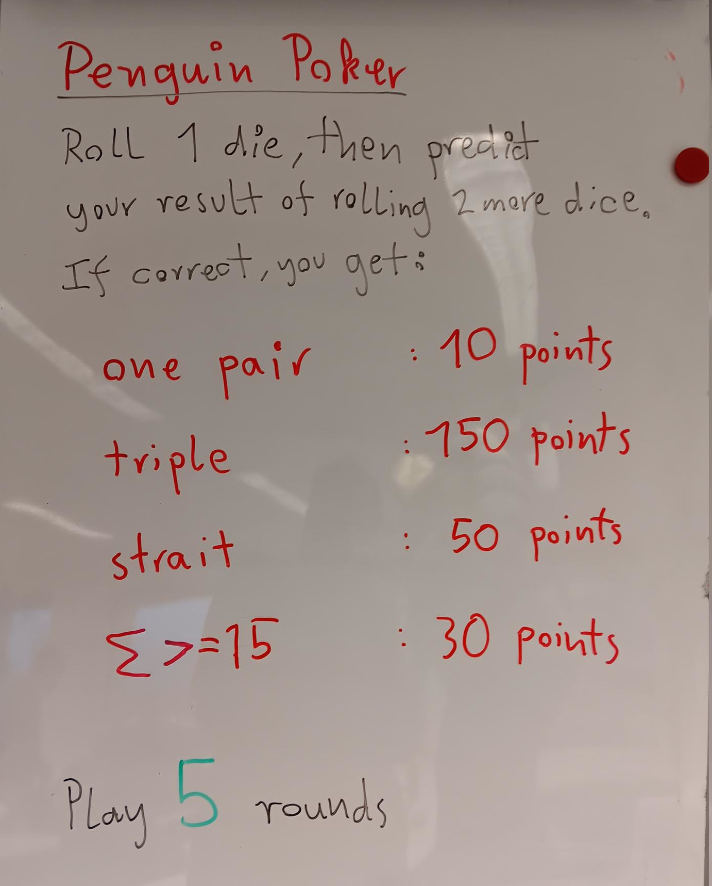

Win Penguin Poker
=================

|image3|

Ein einfaches, reduziertes Würfelspiel, das Ideen aus Kniffeln und Texas
5-Card aufgreift. Die Spieler würfeln einen Würfel und wetten auf eines
von 5 Ereignissen, das nach dem Werfen von 2 weiteren Würfeln eintrifft.
Im Unterschied zum vollständigen Poker oder Kniffel ist Pinguin Poker
leicht komplett berechenbar.

Begriffe: **Wahrscheinlichkeitsbäume**, **bedingte Wahrscheinlichkeit**,
**Satz von Bayes**, **Erwartungswert**

