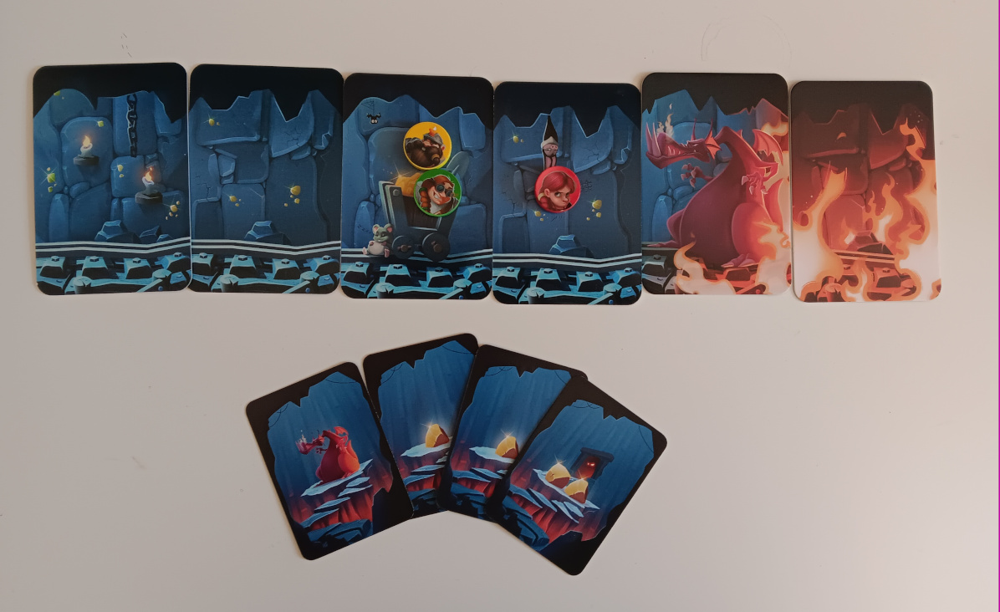
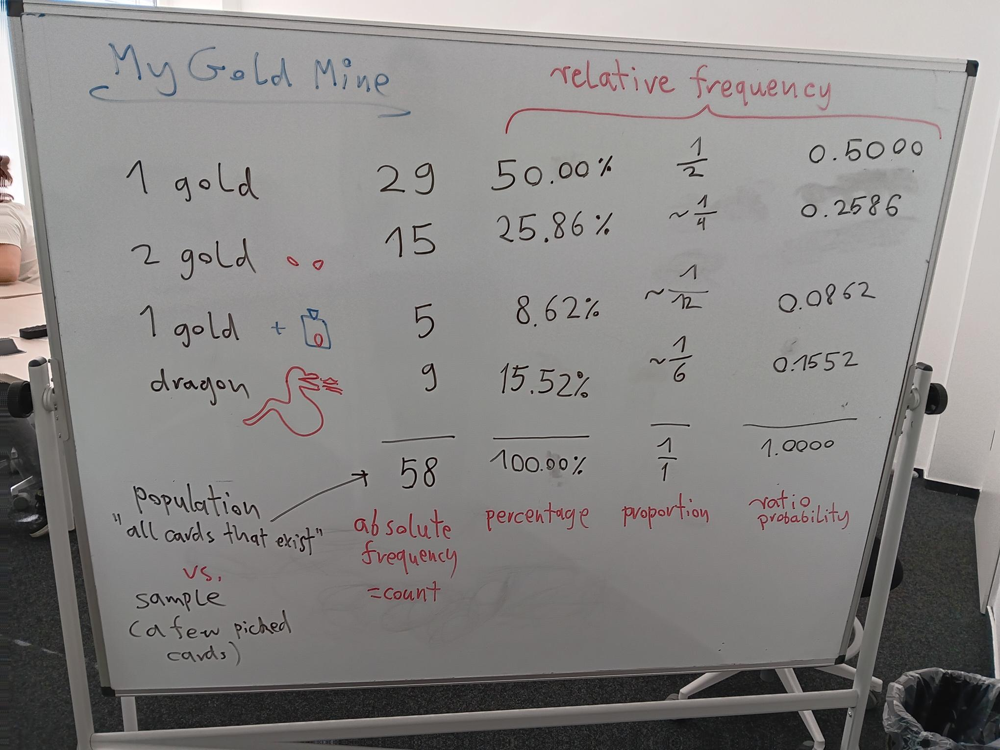

Push your Luck with Frequencies
===============================

*a good moment to run in "My Gold Mine"*

Goal
----

Students calculate absolute and relative frequencies from a deck of cards.

Time
----

90'

Core Concepts
-------------

- absolute frequency
- relative frequency
- ratio
- percentage
- probability
- bar plot
- pie chart

The Game: My Gold Mine
----------------------

**My Gold Mine** puts the players in the role of dwarves in their daily routine: mining gold.
Each turn they decide to mine further or exit the mine.
It would be easy if it were not for the dragon woken up by the dwarves' work.
The mining expedition quickly turns into a messy *"get rich or die trying"* scenario.

.. hint::

   Many other games with a push-your-luck mechanism work.
   Popular games include: Black Jack, Port Royal, Schokohexe, Fröschis

   I chose **My Gold Mine**, because the short explanation / play time fits well into a lesson.
   The mine + dwarf + dragon theme is engaging and the number of cards actually results
   in interesting charts.

Lesson Plan
-----------

1. play a few rounds of **My Gold Mine**. 
2. ask the players how
3. have them count the cards
4. create a table (see image below)
5. calculate absolute frequencies, relative frequencies, probabilities
6. discuss the terminology and differences
7. exercise: draw the frequencies as a bar chart
8. exercise: draw the frequencies as a pie chart
9. examine and discuss good and bad examples of charts

Results
-------

This is how the board might look like:

Questions
---------

- what is the difference between an absolute and relative frequency?
- if no dragon was there for 10 cards, what is the probability that the next card is one?
- if there were already 3 dragons, what is the probability to get a dragon?
- if you change the absolute to relative frequency in a bar chart, what does change?
- when is a pie chart not a good idea?

.. seealso::

   - `My Gold Mine on boardgamegeek.com <https://boardgamegeek.com/boardgame/331571/my-gold-mine>`__
   - `Misty Mountains on Youtube <https://www.youtube.com/watch?v=Pyy_FIYE7EE>`__