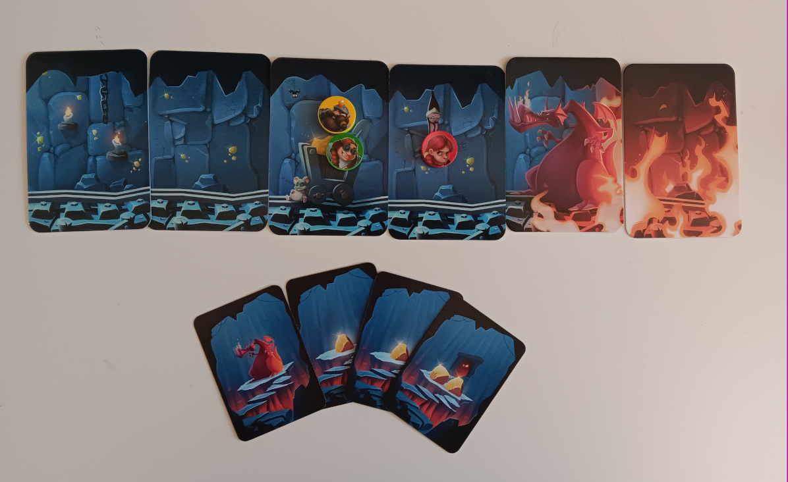
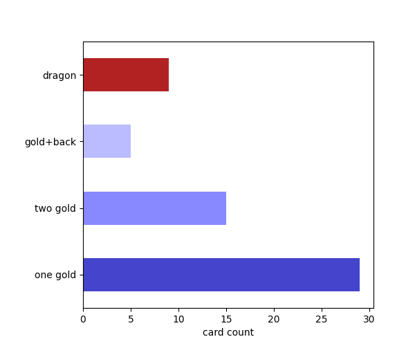

Push your Luck with Frequencies
===============================

*a good moment to run in "My Gold Mine"*

Goal
----

Students calculate absolute and relative frequencies from a deck of cards.

Time
----

90'

Core Concepts
-------------

- absolute frequency
- relative frequency
- ratio
- percentage
- probability
- bar plot
- pie chart

The Game: My Gold Mine
----------------------

`My Gold Mine <https://www.kosmos.de/de/my-gold-mine-2435>`__ puts the players in the role of dwarves in their daily routine: mining gold.
Each turn they decide to mine further or exit the mine.
It would be easy if it were not for the dragon woken up by the dwarves' work.
The mining expedition quickly turns into a messy *"get rich or die trying"* scenario.

.. hint::

   Many other games with a set of similar items work for this lesson.
   The next most similar games from a statistical point of view are **Port Royal** and **Drecksau**.
   
   I chose **My Gold Mine**, because the short explanation / play time fits well into a lesson.
   The mine + dwarf + dragon theme is engaging and the number of cards actually results
   in interesting charts.

.. topic:: What if I don't have any of these games?

   The main point is that you have a diverse set of countable items.
   The lesson structure works by counting the items in a box of chess pieces or a bag of candies.

How to use this Lesson
----------------------

This lesson is a soft start into working with data and numbers.
The actual problem and concepts are very easy.

In a university course, this gives you the liberty to introduce whatever technical tools you would like to use.
So if you need to make sure that your students can work with a spredsheet application of have Python installed,
this lesson gives you a framework to do so.

Lesson Plan
-----------

1. explain the rules of **My Gold Mine**.
2. play 1-3 rounds
3. ask the players to count the cards
4. create a table on the board (see image below)
5. calculate absolute frequencies, relative frequencies and probabilities for each card type
6. discuss the terminology and differences
7. draw the frequencies as a bar chart
8. draw the frequencies as a pie chart
9. discuss some of the reflection questions

Steps 3-6 can be done together or in groups on a work sheet.
Alternatively you could use a spreadsheet 

Steps 7-8 depend on the tools your students will use. You can have students draw the plots on paper or the board.
Alternaviely, use a program with less or more help.

Results
-------

This is how the board might look like:

.. figure:: ../images/my_gold_mine_board.jpg

Here are some bar and pie charts created with a :download:`plots.py`:

   

Reflection Questions
--------------------

- what is the difference between an absolute and relative frequency?
- if no dragon was drawn in the first 10 cards, what is the probability that the next card is a dragon?
- if there were already 3 dragons, what is the probability to get a dragon?
- if you change the absolute to relative frequency in a bar chart, how does it change?
- could you leave away one of the card types from the pie chart?
- what makes a good or bad bar chart?
- describe a winning strategy for **My Gold Mine**?

.. seealso::

   - `My Gold Mine on boardgamegeek.com <https://boardgamegeek.com/boardgame/331571/my-gold-mine>`__
   - `Misty Mountains on Youtube <https://www.youtube.com/watch?v=Pyy_FIYE7EE>`__
   - `Frequency and relative frequency tables <https://www.youtube.com/watch?v=8ffCsdFmuSM>`__ – Youtube video
   - `Absolute und relative Häufigkeiten berechnen <https://www.youtube.com/watch?v=CFZ_RAAJCRI>`__ – Youtube video