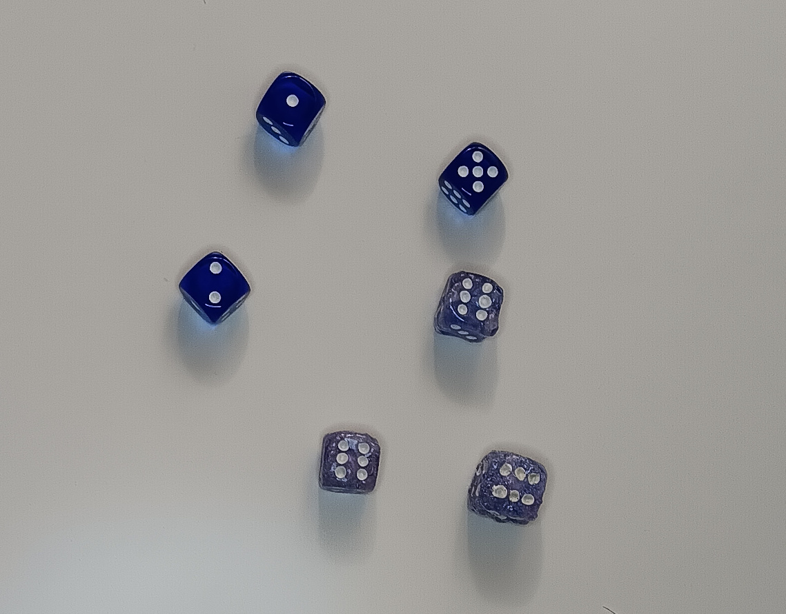

Dice Bakery Hypothesis
======================

Lesson Goal:
------------

Students test whether a six-sided die is balanced.

Time
----

90’

Baking Dice
-----------

This is a didactic *"recipe"* of a special kind.
To prepare the lesson you need a box of six-sided dice.
I recommend standard dice without any glitter or fancy stuff.
Now, bake them:

* pre-heat the oven to 120 degrees Celsius
* put a six-sided die into the oven
* bake it for 10-20 minutes. Use a stopwatch!s
* take out the die and throw it into iced water
* repeat with another die, vary conditions slightly

If the temperature is too high, the cube turns into an amorphous shape.
If it is too low, nothing happens.
However, if the conditions are right, the dice becomes slightly deformed so that it rolls certain numbers more frequently.

Such manipulated dice are a fantastic way to discuss the question:
*"Can we prove that the die is manipulated?"*.
This is where **hypothesis testing** comes in.

.. hint::

   The temperature in most ovens is not very stable, you may want to bake
   one die at a time. If you have a strong group, make this a homework.

Concepts
--------

-  null hypothesis (H0)
-  alternative hypothesis
-  test statistic
-  Chi-square-test
-  significance threshold (alpha)
-  p-value
-  predictive power

Warmup:
-------

Dive right in: *“We want to know whether these dice are balanced”*

Hand out dice and have students do 120 dice rolls each, taking tick
marks about how often each number occurs.

Lesson Plan
-----------

Present and go through the following sequence:

1. decide on a null hypothesis to test (*“the D6 follows a uniform distribution”*)
2. choose a test statistic (:math:`\chi^2`)
3. decide on the significance threshold alpha
4. determine the critical region
5. calculate the test statistic
6. see whether the result is in the critical region
7. accept or reject H0

Collect the numbers from the dice rolls **only after** deciding on the
value for alpha.
Write them into a table and ask the class what they think.
Only after that, calculate the test statistic:

:math:`\chi^2 = \sum \frac{(O_i-E_i)^2}{E}`

where E would be 20 for 120 dice rolls.

Look up the critical values for the Chi-square test statistic using any online tool.
The number of degrees of freedom is five.

The result might look like this:

.. figure:: ../images/chi2_auswertung.jpg
   :width: 800px

.. hint::

   I emphasize that it is easy to mess up a hypothesis test.
   To double-check the results, you can enter them into a LLM like ChatGPT.
   It usually comes up with the correct result and produces a nicely formatted explanation.

Comments:
---------

I skipped a lot of complicated stuff: other tests, error types,
predictive power, because this was the first exposure to hypothesis
testing.

Instead, I spent quite some time to attach huge warnings to the method
and gave examples for p-hacking and the reproducibility crisis.

I also attached a discourse on epistemology and the scientific method: *"How can we know anything at all?"*.
