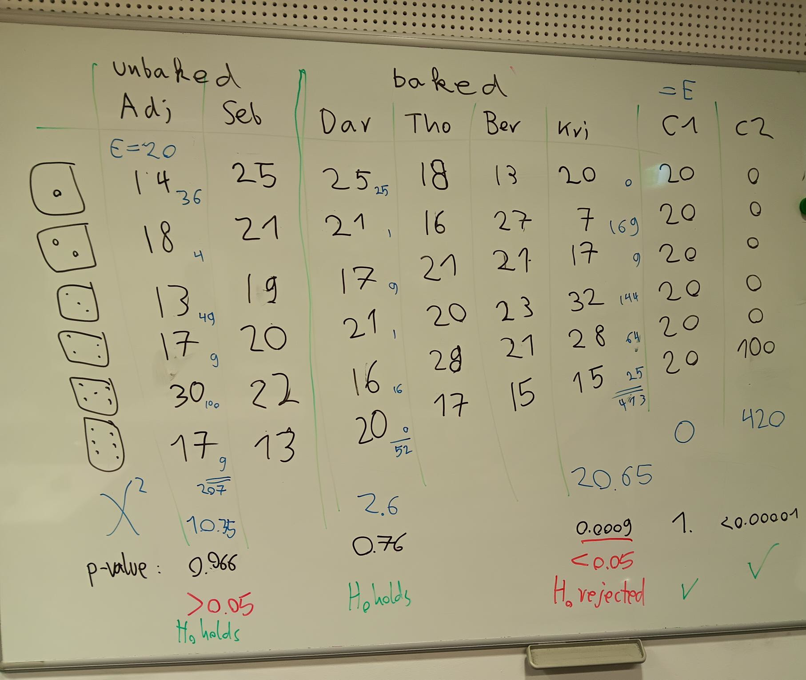

Dice Bakery Hypothesis
======================

Lesson Goal:
------------

Students test whether a six-sided die is balanced.

Time
----

90’

Motivation
----------

This is a didactic *"recipe"* of a special kind:
I put dice (W6) in the oven and baked them at 120-140 degrees for 10-20 minutes.
If the temperature is too high, the cube turns into an amorphous shape. If it is too low, nothing happens.
However, if the conditions are right, the cube becomes so slightly deformed that it rolls certain numbers more frequently.

Such a distorted cube is a fantastic way to discuss the question: *"Can we prove that a cube is distorted?"*.
It is a great opportunity to introduce hypothesis teting.
Answering the question also opens up a deeper perspective: *"How can we know anything at all?"*.

Key Concepts:
-------------

-  null hypothesis (H0)
-  alternative hypothesis
-  test statistic
-  Chi-square-test
-  significance threshold (alpha)
-  critical region
-  p-value
-  predictive power

Prepare forged dice:
--------------------

1. buy a box of D6
2. bake them at 120°-140° for 10-20 minutes
3. then throw into ice water

The temperature in most ovens is not very stable, you may want to bake
one die at a time. If you have a strong group, make this a homework.

Warmup:
-------

Dive right in: *“We want to know whether these dice are balanced”*

Hand out dice and have students do 120 dice rolls each, taking tick
marks about how often each number occurs.

Lesson Plan
-----------

Present and go through the following recipe:

1. decide on a null hypothesis to test (*“the D6 follows a uniform
   distribution”*)
2. choose test statistic
3. decide on alpha
4. determine the critical region
5. calculate the test statistic
6. see whether the result is in the critical region
7. accept or reject H0

Collect the numbers from the dice rolls **only after** deciding on the
value for alpha. Write them into a table and ask with the class what
they think.

Only after that, calculate the test statistic:

:math:`\chi^2 = \sum \frac{(O_i-E_i)^2}{E}`

where E would be 20 for 120 dice rolls.

Look up the critical values for the Chi-square test statistic using any
online tool. The number of degrees of freedom is five.

The result might look like this:

|image6|

Comments:
---------

I skipped a lot of complicated stuff: other tests, error types,
predictive power, because this was the first exposure to hypothesis
testing.

Instead, I spent quite some time to attach huge warnings to the method
and gave examples for p-hacking and the reproducibility crisis.

