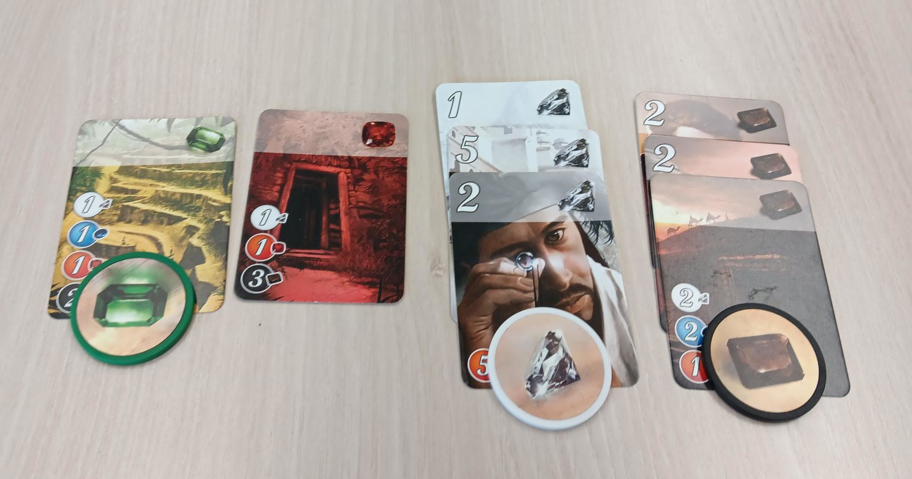

Games to teach Statistics
=========================

Statistics is one of the cornerstones of all scientific work.
The products of statistics in the form of machine learning algorithms (including AI)
have become an integral part of our life.
Yet the subject of statistics is feared in university studies - even among students of technical and scientific subjects.
Much of the content taught in statistics books and courses requires
a high degree of abstraction and a set of formulae that is often far removed from practical application.
At the same time, statistical concepts pervade our everyday experience,
and many basic terms can be understood without the need for
a heavy mathematical framework.

Games contain a wealth of practical applications of statistics.
examples.
On this page, you find games usind cards, dice and more
that make statistics easy to experience and easier to understand.
You find tested lesson plans, recipes for teachers
that can easily be incorporated into your courses.

Students of statistics, data analysis, data science and related topics
should benefit from the lessons, but also the teachers who might
find their own lessons a lot more enjoyable and easier to adapt to their audience.

There are many mathematical treasures hidden in the world of games.
Let's roll the dice!

Games vs. Gamification
----------------------

|image0|

*binary addition with shopping cart tokens*

The word *"gamification "* is often used as a generic term for loosening up
traditional teaching methods. Gamification typically refers to puzzles, quizzes,
matching tasks and gap texts.
They can often be realised within seconds or minutes.
These techniques have become increasingly popular in online courses,
ranging from Coursera to the Duolingo app, who build much or their business model
on gamified lessons.
These puzzles and quizzes are useful teaching tools.
They help to build up and repeat factual knowledge.
However, the engagement with the subject matter largely takes place
in the reproduction of knowledge – the first level in `Bloom's taxonomy <https://www.academis.eu/teaching/planning/blooms_taxonomy.html>`__.

|image1|

*the author solving an Advent of Code puzzle*

More complex examples of gamification are more application-oriented.
In these, problem tasks require the learner to find the path to a solution themselves.
Examples of gamified problems are `Project Euler <https://projecteuler.net>`__,
`Kaggle <https://www.kaggle.com/>`__ and `Advent of Code <https://adventofcode.com/>`__.
The problems usually require a repertoire of alternative solution strategies and
some of them them are challenging even for experienced practitioners.
For example, the time to complete an Advent of Code task is between 10 minutes and 2 days
(for someone with 37 years of programming experience ranking in the top 5% of participants).
There are easier problem sets such as `Codewars <https://www.codewars.com/>`__.
Using them in a classroom setting is possible, but it takes considerable time.

Advantages of board games
-------------------------

|image2|

*a players gem production in a game of "Splendor"*

In numerous board games (including card and dice games), 
mathematical and statistical elements can be found.
In dialogue with the game material, learners reduce their fear of contact
with the subject matter and can put their practical experiences
into words even before they know the mathematical rules.
Board games provide a strong incentive to apply statistics:
*"What is the best move?"*, *"how to beat the game?"* and *"how to win?"*
are strong drivers that motivate students to dive deep into the subject matter
and thus facilitate a later digestion of the theory.

Even though board games do not usually represent an application domain,
they have lots of advantages: they real world actions (rolling dice, moving figures, drawing cards),
help learners to focus and engage with the material.
There is also an inherent social component that encourages learners to cooperate and explore things together.

How to use the material
-----------------------

In the following chapters, you find examples for using board games in:

- entire lesson plans for particular topics from the field of statistics
- priming a group of students to a stati
- warm-up and recap exercises

In all cases the text is aimed at occasional and professional educators
that would like to improve their teaching without using a computer.

