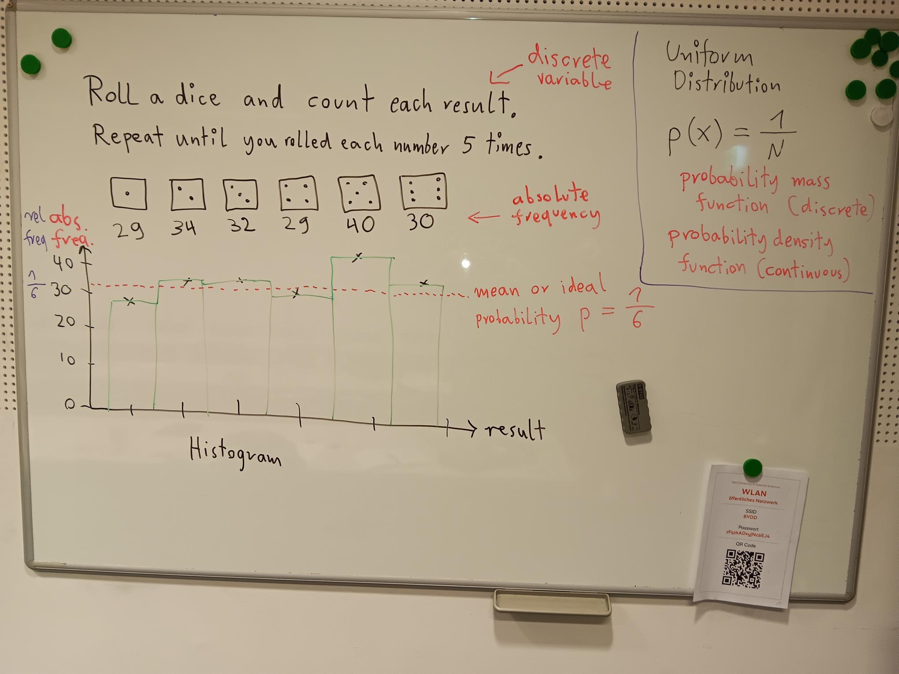

Penguin Olympics
================

|image4|

Mini-Würfelspiele, bei denen Wahrscheinlichkeitsverteilungen generiert
werden.

Begriffe: **Gleichverteilung**, **Geometrische Verteilung**,
**Dreiecksverteilung**, **zentraler Grenzwertsatz**

