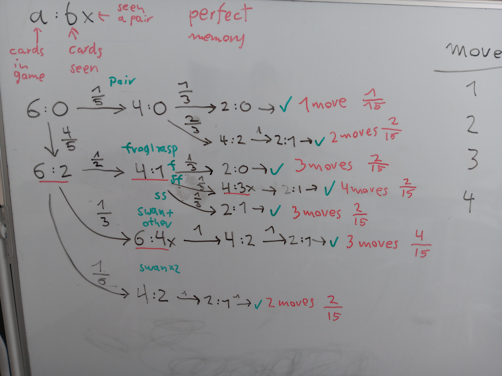

Memory Probability Tree
=======================

.. figure:: ../images/memory.jpg

Goal
----

Students calculate how many turns a game of memory will take.

Lesson Plan
-----------

1. Cooperative Memory
+++++++++++++++++++++

Play a **cooperative** game of Memory: Place all cards face-down on a table. Players take turns and unveil a pair of cards. If the cards match, the pair is removed and they get to unveil another pair.
If the cards mismatch, it's the next players turn.

Players may give each other hints. Count how many turns you need in total.

.. hint::

   With 20 pairs the game takes should take about 5 minutes. With 36 pairs about 15.

2. Perfect Matches
++++++++++++++++++

Calculate together, what is the probability to unveil all pairs in one turn.
Of course, that depends on the number of pairs. E.g. for 20 cards you get:

.. math::

   p(perfect) = \frac{1}{19} \cdot \frac{1}{17} \cdot \frac{1}{15} ...

3. Game situations
++++++++++++++++++

Now, analyze a game with **three pairs**.
For a full analysis, you will need to draw a **probability_tree** covering all possible game situations.

Give pairs of students a deck of three memory cards each.
Ask them to write down all situations that could occur.

.. hint::

   There are nine possible situations.
   We will abbreviate them:

   - `6:0` – six cards, no cards seen
   - `2:1` – two cards left, one card seen
   - `4:3x` – four cards left, three seen and a pair was among them

4. Tree
+++++++

Construct a tree by analyzing which situation can follow from which.
Draw the tree without probabilities first.
There should be 7 paths.

At the bottom of each path, write the number of turns.

The result could look like this:

**probability tree for memory with 6 cards (including a small bug)**

5. Transition Probabilities
+++++++++++++++++++++++++++

Annotate the tree with probabilities for going from one node to the next.
Although many nodes have only one possibility, this needs an entire board.

======== =============== =============== ===============
start    p(transition 1) p(transition 2) p(transition 3)
======== =============== =============== ===============
6:0      p(4:0) = 0.2    p(6:2) = 0.8
6:2      ...
6:4x     ...
4:0      p(2:0) = 0.333  p(4:2) = 0.666
4:1      p(2:0) = 0.333  p(2:1) = 0.5    p(4:3x) = 0.167
4:2      p(4:1) = 1.0
4:3x     p(2:1) = 1.0
2:0      p(0:0) = 1.0
2:1      p(0:0) = 1.0
======== =============== =============== ===============

6. Path Probabilities
+++++++++++++++++++++

Calculate the probability for each path by multiplying the transition probabilities.
This is a good opportunity to introduce **joint probabilities**.

7. Check
++++++++

Make sure the probabilities add up to 1.0.
This is a good opportunity to introduce **total probatility**.

8. Simulate
+++++++++++

By now, it should have become clear that drawing a complete probability tree even for 6 cards is a lot of work. How would you ever finish calculating probabilities for a bigger game?

A pragmatic approach is to **simulate** the game many times with a computer.
Run the simulation through the :ref:`memory_simulator` and see whether you get the same probabilities.
