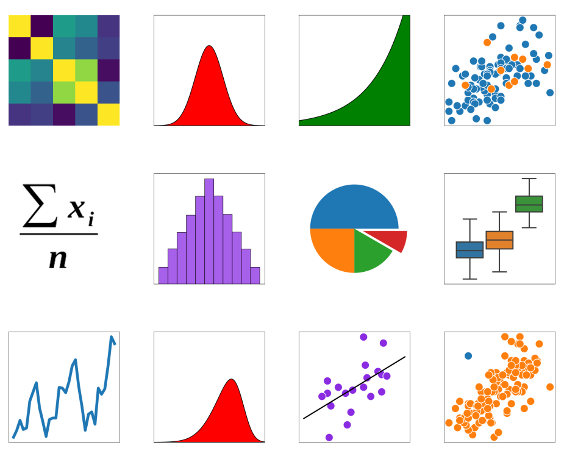

Statistics Memory
=================

**A memory game with 48 cards**

Lesson Goal:
------------

Students talk about statistical concepts while playing memory.

Time
----

15'

Preparations
------------

1. Download the set of 24 memory cards in :download:`memory_images.zip`
2. Print them on 48 cards (I used the `Ravensburger my memory creator <https://www.myravensburger.com/>`__)

Lesson Plan
-----------

Give students the following instructions:

1. shuffle the cards face-down
2. arrange them in a grid
3. one player unveils two cards
4. say what you see on the cards
5. if they match, remove and take another turn
6. else: flip them back and its the next players turn
7. help each other to find all pairs 
