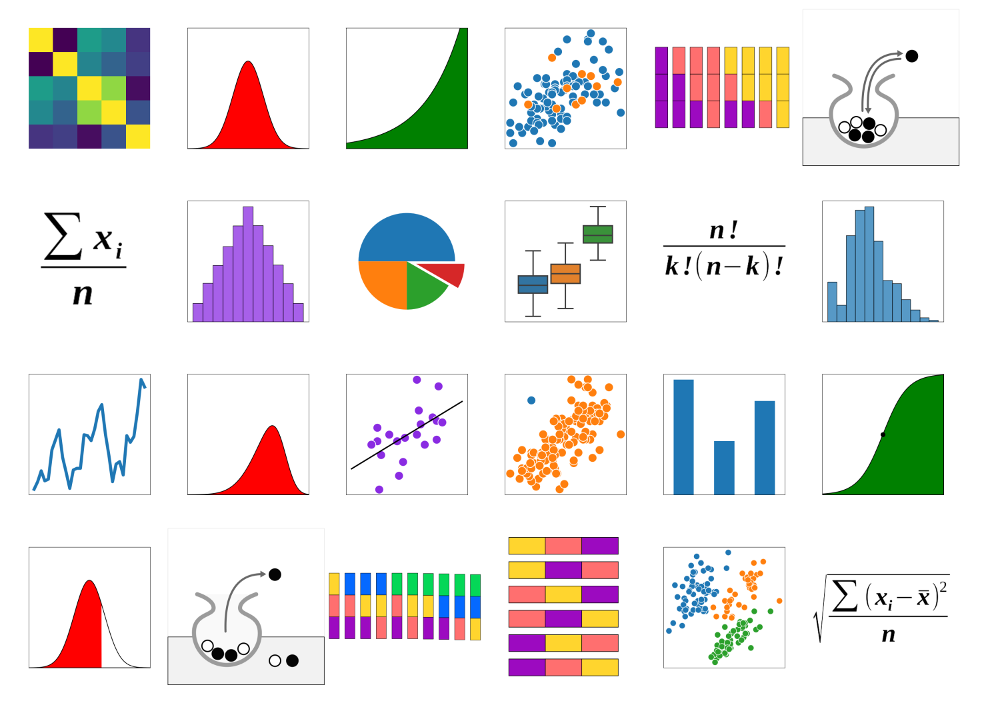

# Probabĺy Fun Memory

**Cards for a memory game to play with my statistics classes.**

by Dr. Kristian Rother (kristian.rother@posteo.de)

available under the conditions of the Creative Commons Attribution Share-Alike License 4.0 (CC-BY-SA 4.0)

## How to use the cards

These cards can be produced with the **Ravensburger Pairfect Designer, 48 cards, 500x500 px**

Also see [www.academis.eu/probably_fun](https://www.academis.eu/probably_fun)

## List of cards
(in alphabeetical order of file names)

* bar plot
* binomial coefficient
* box plot
* combinations with replacement
* exponential function
* correlation matrix as a heatmap
* histogram of ages of passengers on the Titanic
* linear regression (bill depth vs bodymass of Adelie and Chinstrap penguins)
* logistic function
* arithmetic mean
* normal distribution
* interval of normal distribution
* an outlier
* permutations of three colors
* pie chart
* sample of penguins
* scatterplot (more penguins from 3 species)
* standard deviation
* skewed normal distribution
* time series (flights)
* triangular distribution
* combinations without replacement (3 out of 5)
* drawing with replacement
* drawing without replacement

## More ideas for the 36 pair set
   
* Median
* Mode
* range
* Polynomial function
* log scale
* correlation (r=0.8)
* Conditional Prob
* Joint Prob
* Total Prob
* Bayes Theorem
* probability tree
* Binomial dist
* Poisson dist
* biased sample
